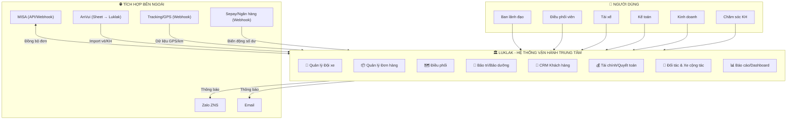
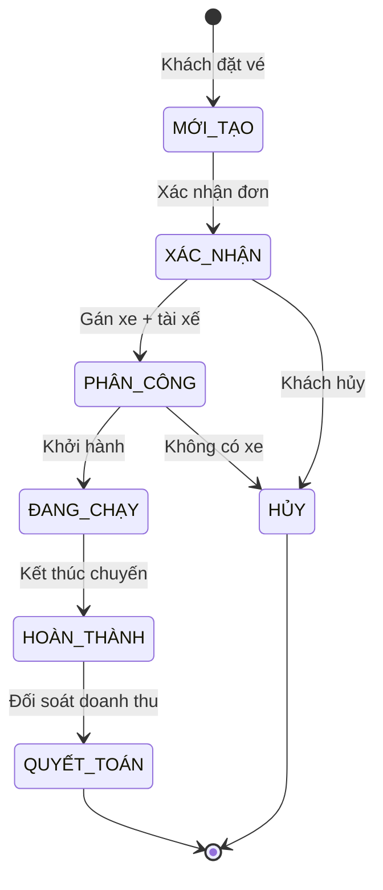
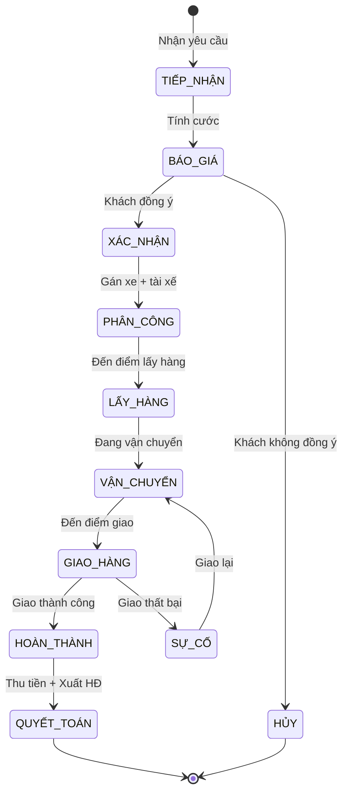
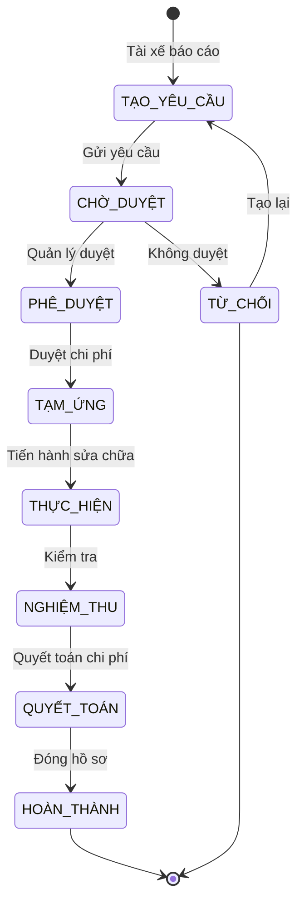
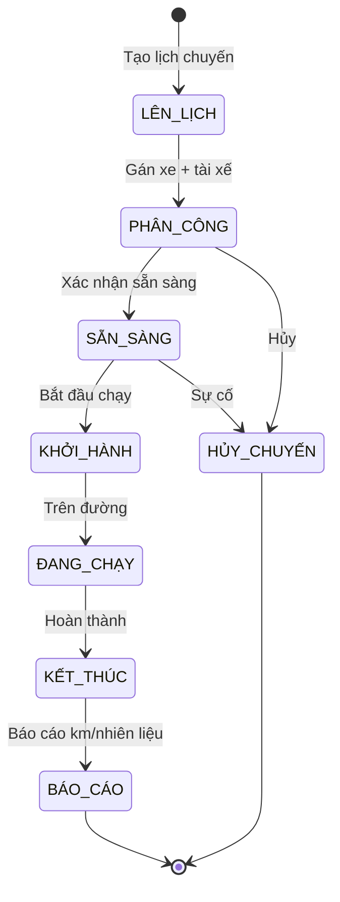
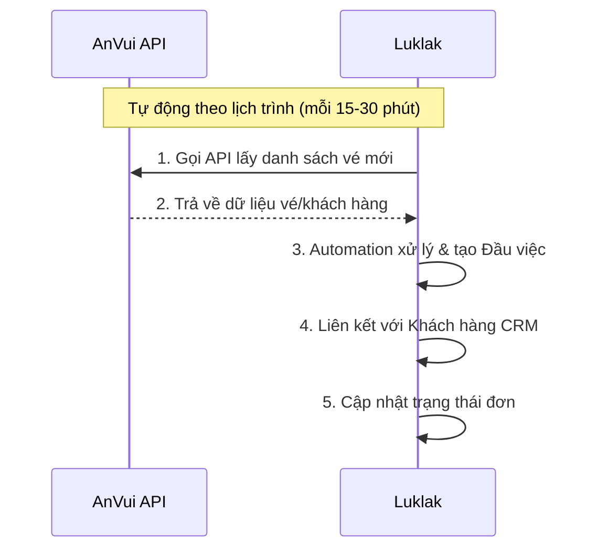
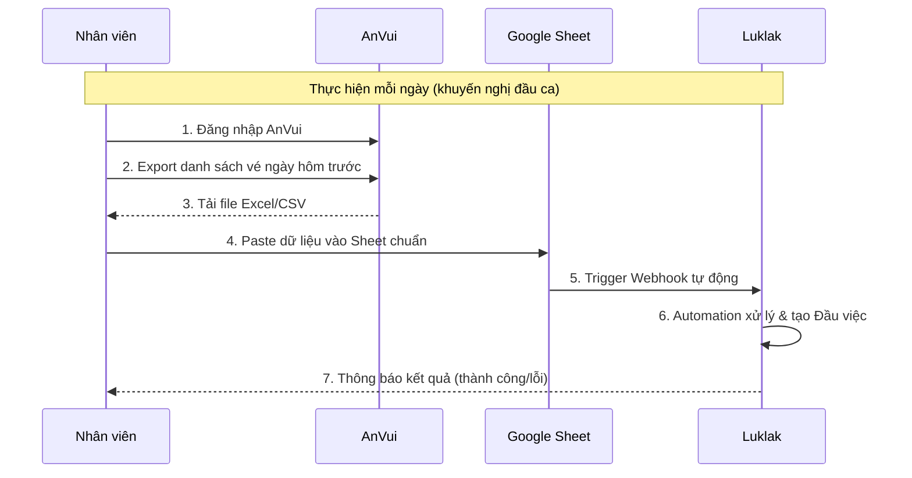
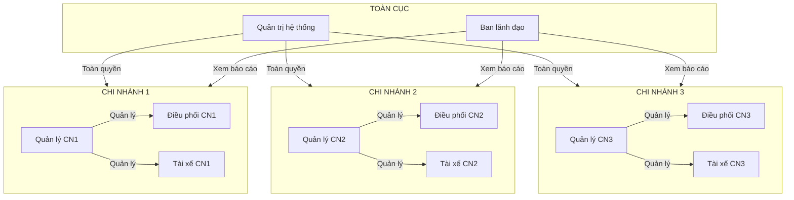
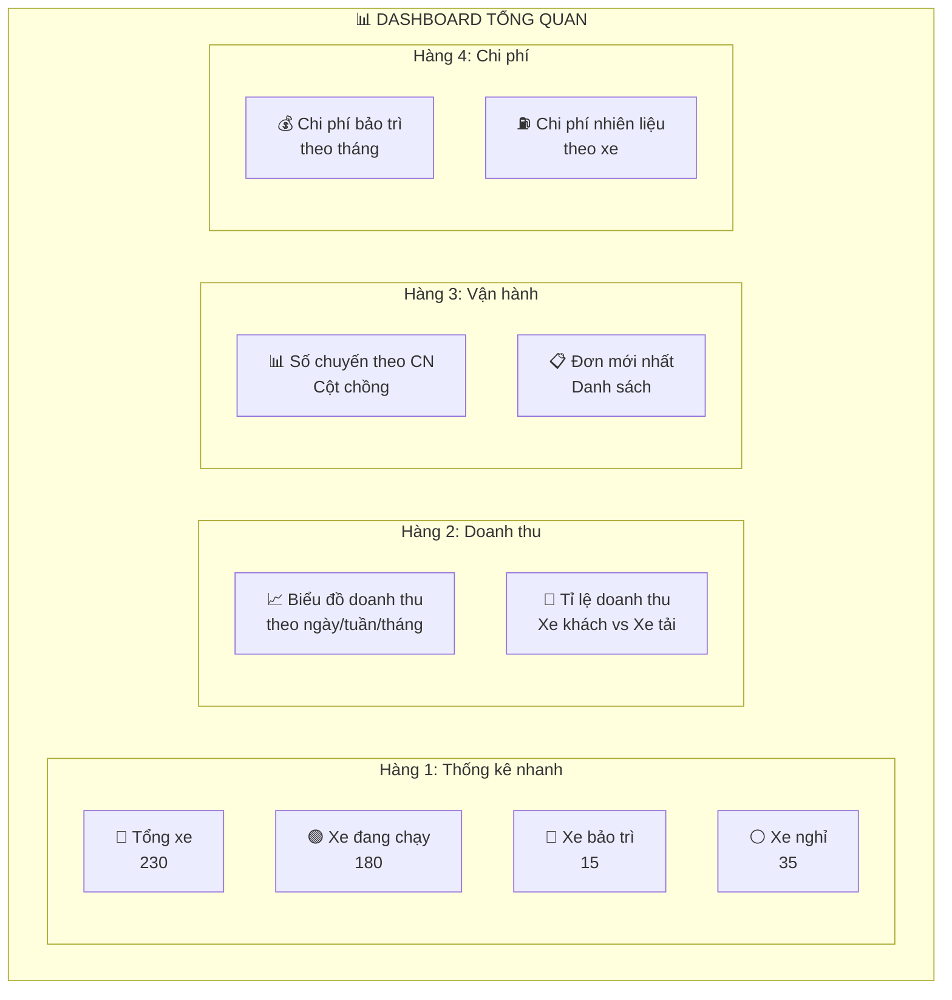

# Giải Pháp Luklak Cho Công Ty Vận Tải

## 1. Tổng Quan Giải Pháp

### 1.1 Mô hình giải pháp



### 1.2 Giá trị mang lại

| Vấn đề hiện tại           | Giải pháp Luklak                  | Kết quả mong đợi                         |
| ------------------------- | --------------------------------- | ---------------------------------------- |
| Phân mảnh dữ liệu         | Dữ liệu tập trung trên 1 nền tảng | Giảm 80% thời gian nhập liệu trùng       |
| Thiếu báo cáo tổng hợp    | Dashboard + UQL xuyên chức năng   | Báo cáo P&L theo xe/tuyến realtime       |
| Khó tích hợp bên thứ 3    | Webhook 2 chiều + Sheet connector | Đồng bộ tự động với MISA, AnVui          |
| App bảo trì riêng lẻ      | Chức năng Bảo trì tích hợp        | Tiết kiệm ~2.5tr/năm + dữ liệu liền mạch |
| Mobile cho tài xế rời rạc | Unified App web + mobile          | 1 app duy nhất cho mọi nghiệp vụ         |

---

## 2. Cấu Trúc Hệ Thống Luklak

```
DOANH NGHIỆP VẬN TẢI
│
├── [KHU VỰC] VẬN HÀNH
│   │
│   ├── [Mảng việc] Đội xe Công ty
│   │   ├── [Loại việc] Xe
│   │   │   ├── [Loại việc con] Xe khách
│   │   │   └── [Loại việc con] Xe tải
│   │   ├── [Loại việc] Tài xế
│   │   │   ├── [Loại việc con] Tài xế chính
│   │   │   └── [Loại việc con] Phụ xe
│   │   └── [Loại việc] Giấy tờ
│   │       ├── [Loại việc con] Đăng kiểm
│   │       ├── [Loại việc con] Bảo hiểm
│   │       └── [Loại việc con] Giấy phép
│   │
│   ├── [Mảng việc] Xe Cộng tác
│   │   └── [Loại việc] Xe cộng tác
│   │
│   ├── [Mảng việc] Vận hành CN1
│   │   ├── [Loại việc] Chuyến xe
│   │   │   ├── [Loại việc con] Chuyến cố định
│   │   │   └── [Loại việc con] Chuyến theo yêu cầu
│   │   └── [Loại việc] Tuyến đường
│   │
│   ├── [Mảng việc] Vận hành CN2 (Tương tự CN1)
│   │
│   └── [Mảng việc] Vận hành CN thứ n (Tương tự CN1)
│
├── [KHU VỰC] KINH DOANH
│   │
│   ├── [Mảng việc] Đơn Xe Khách
│   │   └── [Loại việc] Đơn hành khách
│   │       ├── [Loại việc con] Đơn lẻ
│   │       └── [Loại việc con] Đơn đoàn/thuê xe
│   │
│   ├── [Mảng việc] Đơn Xe Tải
│   │   └── [Loại việc] Đơn vận chuyển hàng
│   │       ├── [Loại việc con] Hàng thường
│   │       ├── [Loại việc con] Hàng đông lạnh
│   │       └── [Loại việc con] Hàng cồng kềnh
│   │
│   └── [Mảng việc] Khách hàng CRM
│       ├── [Loại việc] Khách hàng
│       │   ├── [Loại việc con] Cá nhân
│       │   └── [Loại việc con] Doanh nghiệp
│       ├── [Loại việc] Liên hệ
│       └── [Loại việc] Chăm sóc
│
├── [KHU VỰC] KỸ THUẬT
│   │
│   ├── [Mảng việc] Bảo trì - Bảo dưỡng
│   │   ├── [Loại việc] Yêu cầu bảo trì
│   │   │   ├── [Loại việc con] Sửa chữa
│   │   │   └── [Loại việc con] Thay thế phụ tùng
│   │   └── [Loại việc] Lịch bảo dưỡng
│   │       ├── [Loại việc con] Bảo dưỡng định kỳ
│   │       └── [Loại việc con] Kiểm tra đột xuất
│   │
│   └── [Mảng việc] Sự cố - Khẩn cấp
│       └── [Loại việc] Sự cố
│
└── [KHU VỰC] TÀI CHÍNH
    │
    ├── [Mảng việc] Thu chi
    │   └── [Loại việc] Phiếu thu/chi
    │       ├── [Loại việc con] Thu tiền vé
    │       ├── [Loại việc con] Thu tiền cước
    │       ├── [Loại việc con] Chi phí vận hành
    │       └── [Loại việc con] Chi phí bảo trì
    │
    └── [Mảng việc] Quyết toán
        └── [Loại việc] Hợp đồng
            ├── [Loại việc con] Hợp đồng thuê xe
            └── [Loại việc con] Hợp đồng vận chuyển
```

---

## 3. Chi Tiết Luồng Tiến Trình (Workflow)

### 3.1 Luồng Đơn Vận Chuyển Hành Khách



### 3.2 Luồng Đơn Vận Chuyển Hàng Hóa



### 3.3 Luồng Yêu Cầu Bảo Trì



### 3.4 Luồng Quản lý Chuyến xe



---

## 4. Tích Hợp Bên Ngoài

### 4.1 Tích hợp AnVui - 2 Phương án

> **Lưu ý**: Cần xác nhận với AnVui về khả năng cấp API trước khi quyết định phương án.

#### Phương án A: Tích hợp trực tiếp qua API (Ưu tiên nếu được)

Nếu AnVui cấp API, đây là phương án tối ưu nhất:



**Ưu điểm:**

- Dữ liệu realtime hoặc gần realtime
- Không cần thao tác thủ công hàng ngày
- Giảm sai sót do nhập liệu

**Yêu cầu từ AnVui:**

- API key và tài liệu API
- Endpoint lấy danh sách vé, khách hàng
- Rate limit và quota cho phép

---

#### Phương án B: Cập nhật thủ công qua Google Sheet (Backup/Nếu không có API)

Nếu AnVui không cấp API, nhân viên cần cập nhật thủ công hàng ngày:



**Quy trình thủ công cho nhân viên:**

| Bước     | Thao tác                              | Thời gian ước tính |
| -------- | ------------------------------------- | ------------------ |
| 1        | Đăng nhập AnVui, chọn ngày cần export | 1 phút             |
| 2        | Export danh sách vé ra file Excel     | 2 phút             |
| 3        | Mở Google Sheet mẫu, paste dữ liệu    | 2 phút             |
| 4        | Nhấn nút "Đồng bộ" để trigger webhook | 1 phút             |
| 5        | Kiểm tra log kết quả                  | 1 phút             |
| **Tổng** |                                       | **~7 phút/ngày**   |

**Lưu ý:**

- Cần tạo template Google Sheet với các cột chuẩn
- Automation trong Luklak sẽ validate dữ liệu trước khi tạo Đầu việc
- Có log lỗi để nhân viên sửa nếu dữ liệu không hợp lệ

---

### 4.2 Chi tiết tích hợp các hệ thống khác

| Hệ thống         | Phương thức  | Chi tiết                                                   |
| ---------------- | ------------ | ---------------------------------------------------------- |
| **MISA**         | API 2 chiều  | Đồng bộ đơn hàng, hóa đơn (cần xác nhận MISA có API không) |
| **Tracking/GPS** | Webhook      | Nhà cung cấp tracking bắn webhook dữ liệu km, vị trí       |
| **Sepay**        | Webhook      | Biến động số dư ngân hàng → Auto đối soát thanh toán       |
| **Zalo ZNS**     | API Outbound | Gửi thông báo cho khách hàng, tài xế                       |
| **Email**        | SMTP         | Gửi email xác nhận, thông báo                              |

---

## 5. Luồng Sử Dụng Thực Tế Của Nhân Sự

### 5.1 Một ngày làm việc của Điều phối viên

#### Đầu ca (7:00 - 8:00)

| Bước | Thao tác                           | Mục đích                                          |
| ---- | ---------------------------------- | ------------------------------------------------- |
| 1    | Đăng nhập Luklak                   | Bắt đầu ca làm việc                               |
| 2    | Xem Dashboard                      | Nắm tình trạng xe: sẵn sàng / đang chạy / bảo trì |
| 3    | Mở Bộ lọc "Đơn chưa phân công"     | Xem danh sách đơn cần xử lý hôm nay               |
| 4    | Import dữ liệu từ AnVui (nếu PA B) | Đồng bộ vé từ AnVui vào hệ thống                  |

#### Phân công (8:00 - 9:00)

| Bước | Thao tác                         | Mục đích                              |
| ---- | -------------------------------- | ------------------------------------- |
| 5    | Mở từng Đơn hàng chưa phân công  | Xem chi tiết yêu cầu                  |
| 6    | Chọn Xe phù hợp từ danh sách     | Dựa vào loại xe, sức chứa, tình trạng |
| 7    | Gán Tài xế cho chuyến            | Chọn tài xế sẵn sàng                  |
| 8    | Chuyển trạng thái → PHÂN_CÔNG    | Xác nhận việc phân công               |
| 9    | (Tự động) Hệ thống gửi thông báo | Tài xế nhận việc qua app              |

#### Giám sát (Cả ngày)

| Bước | Thao tác                              | Mục đích                                 |
| ---- | ------------------------------------- | ---------------------------------------- |
| 10   | Theo dõi Kanban trạng thái các chuyến | Biết xe nào đang chạy, xe nào hoàn thành |
| 11   | Nhận thông báo khi có sự cố           | Xử lý kịp thời                           |
| 12   | Xử lý thay đổi/hủy chuyến             | Phân công lại nếu cần                    |

#### Cuối ca (17:00 - 18:00)

| Bước | Thao tác                          | Mục đích                        |
| ---- | --------------------------------- | ------------------------------- |
| 13   | Kiểm tra các chuyến HOÀN_THÀNH    | Đảm bảo tất cả đã xong          |
| 14   | Đối soát km/nhiên liệu với Tài xế | Xác nhận số liệu                |
| 15   | Chuyển trạng thái → QUYẾT_TOÁN    | Đóng chuyến, chuyển cho kế toán |

### 5.2 Chi tiết thao tác Phân công xe (Quy trình thủ công)

Vì việc phân công xe phụ thuộc nhiều yếu tố và cần quyết định của con người, quy trình này được thiết kế để hỗ trợ điều phối viên ra quyết định nhanh hơn:

**Bước 1: Xem danh sách đơn cần phân công**

- Mở Mảng việc "Đơn Xe Khách" hoặc "Đơn Xe Tải"
- Sử dụng Bộ lọc lưu sẵn: "Đơn chưa phân công hôm nay"
- Sắp xếp theo thời gian khởi hành

**Bước 2: Xem xe sẵn sàng**

- Mở tab mới → Mảng việc "Đội xe"
- Sử dụng Bộ lọc: "Xe sẵn sàng" (loại bỏ xe đang bảo trì, đang chạy)
- Xem thông tin: Biển số, Loại xe, Sức chứa, Tài xế gắn liền

**Bước 3: Ra quyết định phân công**

| Tiêu chí cần xem xét | Thông tin trong Luklak                        |
| -------------------- | --------------------------------------------- |
| Loại hàng/khách      | Trường "Loại đơn" trên Đầu việc Đơn hàng      |
| Khối lượng/số khách  | Trường "Số lượng" trên Đầu việc Đơn hàng      |
| Tuyến đường          | Trường "Điểm đi - Điểm đến"                   |
| Lịch của tài xế      | Xem Giao diện Lịch của Tài xế                 |
| Xe phù hợp           | Trường "Sức chứa", "Loại xe" trên Đầu việc Xe |

**Bước 4: Gán xe và tài xế**

- Mở chi tiết Đơn hàng
- Điền Trường "Xe phân công" → chọn từ danh sách xe sẵn sàng
- Điền Trường "Tài xế" → chọn tài xế của xe đó
- Nhấn nút chuyển trạng thái → "PHÂN_CÔNG"

**Bước 5: Hệ thống tự động thực hiện**

- Gửi thông báo Luklak cho Tài xế
- Gửi Zalo ZNS/Email cho Khách hàng (nếu có cấu hình)
- Cập nhật trạng thái xe → "Đã có lịch"

### 5.3 Một ngày làm việc của Tài xế

#### Đầu ca

| Bước | Thao tác                      | Ghi chú                                        |
| ---- | ----------------------------- | ---------------------------------------------- |
| 1    | Mở app Luklak trên điện thoại | Đăng nhập nếu cần                              |
| 2    | Xem Inbox                     | Xem các chuyến được gán hôm nay                |
| 3    | Xem chi tiết chuyến           | Tuyến đường, thông tin khách, ghi chú đặc biệt |

#### Chạy chuyến

| Bước | Thao tác                            | Ghi chú                       |
| ---- | ----------------------------------- | ----------------------------- |
| 4    | Nhấn "Khởi hành"                    | Cập nhật trạng thái chuyến    |
| 5    | Hoàn thành chuyến → Nhấn "Kết thúc" | Đánh dấu xong                 |
| 6    | Nhập km cuối, nhiên liệu đã đổ      | Số liệu để quyết toán         |
| 7    | Chụp Live Photo (nếu cần)           | Xác nhận giao hàng, trả khách |

#### Báo cáo sự cố (nếu có)

| Bước | Thao tác                       | Ghi chú                       |
| ---- | ------------------------------ | ----------------------------- |
| 1    | Tạo Đầu việc "Yêu cầu bảo trì" | Mô tả sự cố                   |
| 2    | Upload ảnh                     | Chụp ảnh hiện trạng           |
| 3    | Chờ Quản lý phê duyệt          | Nhận thông báo khi được duyệt |

### 5.4 Một ngày làm việc của Kinh doanh/Chăm sóc KH

| Thời điểm                | Thao tác                                          | Nơi thực hiện trong Luklak  |
| ------------------------ | ------------------------------------------------- | --------------------------- |
| **Khi có khách gọi đặt** | Tạo Đầu việc "Đơn hàng" mới                       | Mảng việc: Đơn Xe Khách/Tải |
|                          | Điền thông tin: KH, Tuyến, Ngày giờ, Ghi chú      | Form chi tiết Đầu việc      |
|                          | Liên kết với Khách hàng CRM (tạo mới nếu chưa có) | Trường "Khách hàng"         |
| **Theo dõi đơn**         | Xem Kanban trạng thái đơn                         | Giao diện Kanban            |
|                          | Lọc "Đơn của tôi"                                 | Bộ lọc lưu sẵn              |
| **Chăm sóc sau chuyến**  | Tạo Đầu việc "Chăm sóc"                           | Mảng việc: CRM              |
|                          | Gọi điện qua Tổng đài tích hợp                    | Hành động trên Đầu việc     |
|                          | Ghi nhận phản hồi                                 | Trường "Nội dung chăm sóc"  |

---

## 6. Phân Quyền Theo Chi Nhánh

### 6.1 Mô hình phân quyền



### 6.2 Ma trận phân quyền

| Vai trò          | Xem tất cả CN  | Xem CN mình        | Tạo đơn | Phân công | Duyệt bảo trì | Xem báo cáo  |
| ---------------- | -------------- | ------------------ | ------- | --------- | ------------- | ------------ |
| **Quản trị**     | ✅             | ✅                 | ✅      | ✅        | ✅            | ✅           |
| **Ban lãnh đạo** | ✅             | ✅                 | ❌      | ❌        | ❌            | ✅           |
| **Quản lý CN**   | ❌             | ✅                 | ✅      | ✅        | ✅            | ✅ (CN mình) |
| **Điều phối**    | ❌             | ✅                 | ✅      | ✅        | ❌            | ❌           |
| **Tài xế**       | ❌             | ✅ (việc của mình) | ❌      | ❌        | ❌            | ❌           |
| **Kinh doanh**   | ❌             | ✅                 | ✅      | ❌        | ❌            | ❌           |
| **Kế toán**      | ✅ (tài chính) | ✅                 | ❌      | ❌        | ❌            | ✅           |

---

## 7. Dashboard & Báo Cáo

### 7.1 Dashboard tổng quan



### 7.2 Các loại báo cáo cần xây dựng

| STT | Báo cáo                | Nguồn dữ liệu                | Đối tượng sử dụng |
| --- | ---------------------- | ---------------------------- | ----------------- |
| 1   | **P&L theo xe**        | Đơn hàng + Chi phí + Bảo trì | Ban lãnh đạo      |
| 2   | **P&L theo tuyến**     | Chuyến xe + Doanh thu        | Ban lãnh đạo      |
| 3   | **P&L theo chi nhánh** | Tất cả Mảng việc của CN      | Ban lãnh đạo      |
| 4   | **Hiệu suất tài xế**   | Chuyến xe + Đánh giá         | Quản lý CN        |
| 5   | **Chi phí bảo trì**    | Yêu cầu bảo trì              | Quản lý, Kế toán  |
| 6   | **Doanh thu theo KH**  | Đơn hàng + CRM               | Kinh doanh        |
| 7   | **Tình trạng đội xe**  | Xe + Giấy tờ                 | Vận hành          |

---

## 8. Lợi Ích & ROI Dự Kiến

### 8.1 Lợi ích định lượng

| Chỉ tiêu                   | Hiện tại  | Sau triển khai | Tiết kiệm |
| -------------------------- | --------- | -------------- | --------- |
| Thời gian nhập liệu/ngày   | 4 giờ     | 1 giờ          | 75%       |
| Chi phí app bảo trì        | 2.5tr/năm | 0 (tích hợp)   | 100%      |
| Thời gian làm báo cáo/tuần | 8 giờ     | 1 giờ          | 87%       |
| Sai sót nhập liệu          | ~5%       | <1%            | 80%       |

### 8.2 Lợi ích định tính

- ✅ Dữ liệu thống nhất, không phân mảnh
- ✅ Quản lý được P&L theo xe/tuyến/chi nhánh
- ✅ Mobile app cho tài xế dùng mọi lúc mọi nơi
- ✅ Phân quyền linh hoạt theo chi nhánh
- ✅ Tự động hóa giảm công việc thủ công
- ✅ Dễ dàng mở rộng khi công ty phát triển

---

## 9. Rủi Ro & Giải Pháp

| Rủi ro                                               | Xác suất   | Tác động   | Giải pháp                                                               |
| ---------------------------------------------------- | ---------- | ---------- | ----------------------------------------------------------------------- |
| API MISA/AnVui không ổn định hoặc không thể tích hợp | Trung bình | Cao        | Dùng song song và thêm dữ liêu được thêm thủ công lưu trữ trên gg sheet |
| Nhân viên chưa quen hệ thống                         | Cao        | Trung bình | Training kỹ + Hướng dẫn luồng                                           |
| Dữ liệu lịch sử chưa chuẩn                           | Trung bình | Thấp       | Import dần + Làm sạch                                                   |
| Webhook bị lỗi/timeout                               | Thấp       | Trung bình | Retry mechanism + Log                                                   |

---
